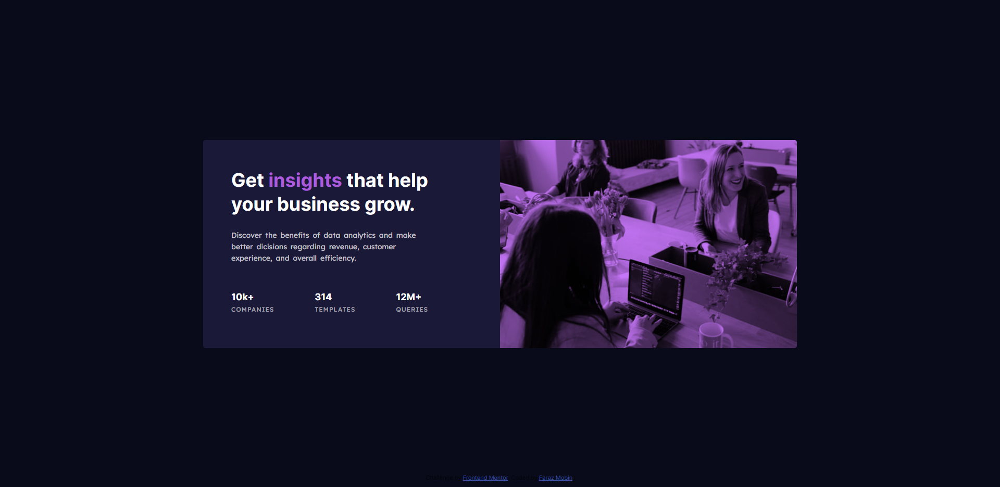
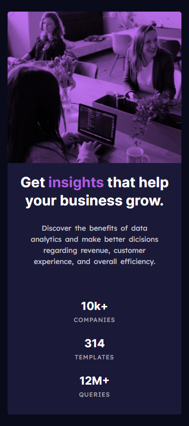

# Frontend Mentor - Stats preview card component solution

This is a solution to the [Stats preview card component challenge on Frontend Mentor](https://www.frontendmentor.io/challenges/stats-preview-card-component-8JqbgoU62). Frontend Mentor challenges help you improve your coding skills by building realistic projects. 

## Table of contents

- [Overview](#overview)
  - [The challenge](#the-challenge)
  - [Screenshot](#screenshot)
  - [Links](#links)
- [My process](#my-process)
  - [Built with](#built-with)
  - [What I learned](#what-i-learned)
- [Author](#author)

**Note: Delete this note and update the table of contents based on what sections you keep.**

## Overview

### The challenge

Users should be able to:

- View the optimal layout depending on their device's screen size

### Screenshot

#### Desktop Version

#### Mobile Version

### Links

- Solution URL: [Add solution URL here](https://github.com/Faraz-mobin17/preview-card-component)
- Live Site URL: [Add live site URL here](https://distracted-euler-78d449.netlify.app/)

## My process

### Built with

- Semantic HTML5 markup
- CSS custom properties
- Flexbox
- desktop-first workflow

### What I learned

This project has helped me to recall use of flexbox to design a responsive layout.iding code samples of areas you want to highlight is a great way to reinforce your own knowledge.

## Author

- Website - [Faraz Mobin](https://distracted-euler-78d449.netlify.app/)
- Frontend Mentor - [@Faraz-mobin17](https://www.frontendmentor.io/profile/Faraz-mobin17)
- Twitter - [@Faraz_mobin](https://twitter.com/Faraz_mobin)
